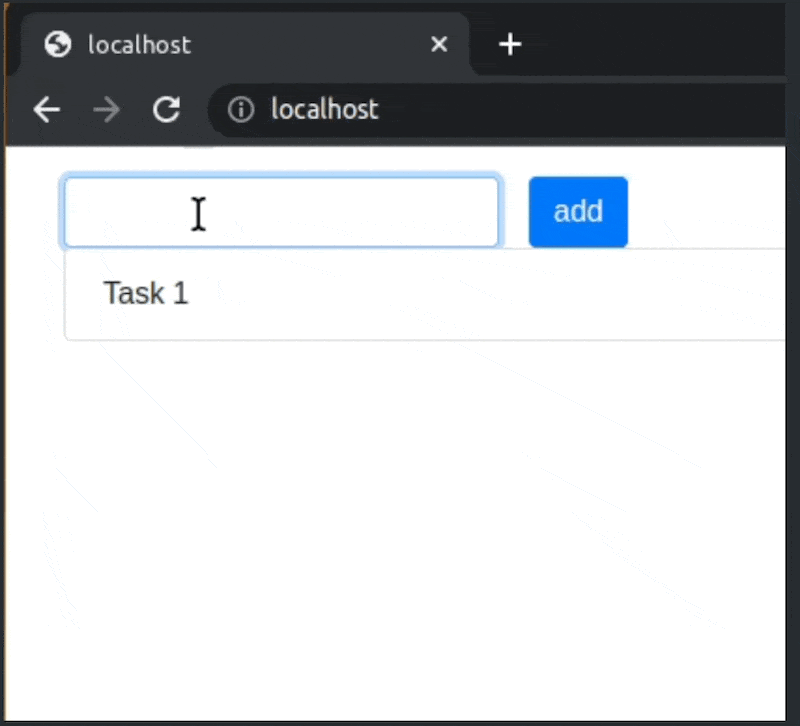

## src/application.js
Implements and exports a function that creates a TODO app on the page. 
The app comprises a form to add tasks and a list of tasks added via teh form. 
Each new task is added to the top of the list.

Usage Example


Initial HTML:

```html
<div class="container m-3">
  <form class="form-inline">
    <input type="text" required="required" class="form-control mr-3" name="name">
    <button type="submit" class="btn btn-primary mr-3">add</button>
  </form>
  <ul id="tasks" class="list-group" aria-label="Tasks"></ul>
</div>
```

HTML after adding two tasks

```html
<div class="container m-3">
  <form class="form-inline">
    <input type="text" required="required" class="form-control mr-3" name="name">
    <button type="submit" class="btn btn-primary mr-3">add</button>
  </form>
  <ul id="tasks" class="list-group" aria-label="Tasks">
    <li class="list-group-item">Вторая задача</li>
    <li class="list-group-item">Первая задача</li>
  </ul>
</div>
```

The app uses a backend that can create new tasks and return a list of tasks added earlier. 

У нашего TODO-приложения есть бэкенд. Этот бэкенд умеет получать новые задачи и возвращать список ранее добавленных задач.

```js
import axios from 'axios';

// List of added tasks using GET
const response = await axios.get(routes.tasksPath());
// response.data has an object like this: { items: [{ name: 'task name' }, { ... }]  }

// Adding a new task using POST
const response = await axios.post(routes.tasksPath(), data); // data is an object like this { name: 'task name' }
// response.status is 201 if successful
```

When initialized, the app makes a request to the server to get a list of tasks created earlier and displays them on the screen. 

When a new task is added, the app send it to the server.
